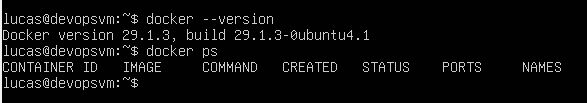
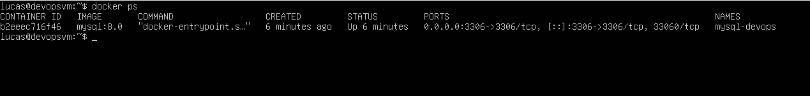
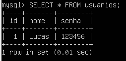

# Atividade DevOps: MySQL em container Docker

Atividade do curso de DevOps: subir um container MySQL dentro de uma VM e criar um banco de dados simples com a tabela `usuarios`.

## Objetivo

Dentro de uma VM Linux (2 GB de RAM, 1 CPU, Docker instalado), usar a imagem oficial do MySQL para:

1. Criar e executar um container MySQL
2. Criar um banco de dados
3. Criar a tabela `usuarios` (campos `nome` e `senha`)
4. Inserir um registro e consultá-lo

## Ambiente

| Item | Valor |
|---|---|
| Virtualizador | VirtualBox |
| Sistema da VM | Ubuntu Server |
| Memória | 2 GB |
| CPU | 1 |
| Rede | Bridge |
| Docker | 29.1.3 |
| Imagem | `mysql:8.0` |

## Passo a passo

### 1. Criar a VM

- Criada no VirtualBox com 2 GB de RAM, 1 CPU e disco de 25 GB.
- Instalação manual do Ubuntu Server, com OpenSSH server habilitado.

### 2. Instalar o Docker na VM

```bash
sudo apt update
sudo apt install -y docker.io
sudo systemctl enable --now docker
sudo usermod -aG docker $USER
```

Verificação:

```bash
docker --version
docker ps
```



### 3. Rodar o container MySQL

```bash
docker run -d \
  --name mysql-devops \
  -e MYSQL_ROOT_PASSWORD=senha123 \
  -e MYSQL_DATABASE=banco-devops \
  -p 3306:3306 \
  mysql:8.0
```

| Parâmetro | Função |
|---|---|
| `-d` | Executa em segundo plano |
| `--name mysql-devops` | Nome do container |
| `-e MYSQL_ROOT_PASSWORD` | Define a senha do usuário root |
| `-e MYSQL_DATABASE` | Cria o banco na inicialização |
| `-p 3306:3306` | Expõe a porta do MySQL |

Verificação:

```bash
docker ps
```



### 4. Acessar o MySQL dentro do container

```bash
docker exec -it mysql-devops mysql -u root -p
```

### 5. Criar a tabela e inserir dados

```sql
USE `banco-devops`;

CREATE TABLE usuarios (
  id INT AUTO_INCREMENT PRIMARY KEY,
  nome VARCHAR(100) NOT NULL,
  senha VARCHAR(255) NOT NULL
);

INSERT INTO usuarios (nome, senha) VALUES ('Lucas', '123456');

SHOW DATABASES;
SHOW TABLES;
SELECT * FROM usuarios;
```



## Problemas encontrados e soluções

| Problema | Causa | Solução |
|---|---|---|
| `Conflict. The container name is already in use` | O `docker run` foi executado duas vezes com o mesmo nome | `docker rm -f mysql-devops` e rodar o comando novamente |
| `ERROR 1064` no `USE 'banco-devops'` | Nome com hífen exige crases, não aspas simples | Usar `` USE `banco-devops`; `` ou nomear o banco com underline (`banco_devops`) |

## Aprendizados

- Diferença entre imagem e container, e o papel das variáveis de ambiente (`-e`) na configuração do MySQL.
- Uso de `docker run`, `docker ps`, `docker exec` e `docker rm`.
- Containers têm nome único: é preciso removê-los antes de recriar com o mesmo nome.
- Ao usar a porta `-p 3306:3306`, o banco pode ser acessado de fora da VM pelo IP dela (por exemplo, com HeidiSQL).

## Observação sobre segurança

As senhas usadas aqui (`senha123`, `123456`) são apenas para fins didáticos neste laboratório. Em ambientes reais, nunca versione senhas no repositório: use variáveis de ambiente, arquivos `.env` ignorados pelo Git ou gerenciadores de segredos.